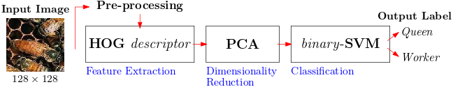
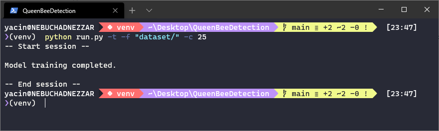
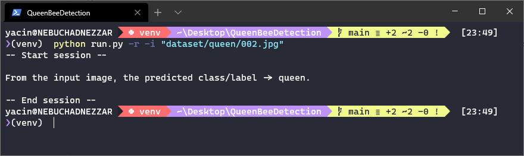
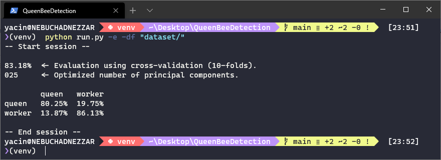

# QueenBeeDetection

***This is the source code and implementation of a method using traditional machine learning in order to autonomously detect and recognize a bee queens and workers in a beehive. It has been used in the context of an international conference.***

---

## Table of Contents

1. [System Overview](#system-overview)
2. [Built With](#built-with)
3. [Installation](#installation)
4. [Basic Usage](#basic-usage)
5. [Features](#features)
6. [Contributing](#contributing)
7. [References](#references)
8. [License](#license)

---

## System Overview

The proposed sysem might be described by the following figure:



It consists of three main components namely:

- Feature extraction with **HOG** *(Histogram of Oriented Gradients)*,
- Dimensionality reduction with **PCA** *(Principal Components Analysis)*,
- Classification with **SVM** *(Support Vector Machines)*.

## Built With

This project is built using these technologies:

- Programming Language: **Python 3.7.6 x64**
- Libraries: 
  - **Numpy**: https://numpy.org/
  - **OpenCV**: https://opencv.org/
  - **Scikit-Image**: https://scikit-image.org/
  - **Scikit-Learn**: https://scikit-learn.org/ 
- Integrated Development Environment: **Microsoft Visual Studio code x64**

## Installation

In order to use this implementation, one has to proceed as follows:

1. Install **pip** for *package management* and **virtualenv** for *virtual environnements*,  
2. Create a *virtual environnement* with **virtualenv** and activate it : `virtualenv venv`,
3. Install all the dependecies using the provided `requirement.txt` : `python -m pip install -r requirements.txt`,
4. Use the `run.py` with the instructions below (see [Basic Usage](#basic-usage)).

## Basic Usage

At any time, you may execute the command `python ./run.py -h` to display the help & instructions:

```
usage: run.py [-h] [-t] [-f] [-c] [-r] [-i] [-e] [-df]

Queen Bee Detection and Recognition by Yacine YADDADEN [ https://github.com/yyaddaden ]

optional arguments:
  -h, --help           show this help message and exit

train a model:
  -t, --train          training
  -f , --folder        traning folder
  -c , --components    number of components

perform recognition:
  -r, --recognition    recognition
  -i , --image         bee image

model evaluation:
  -e, --evaluation     evaluation
  -df , --datafolder   dataset folder
```

### 1. Training a *model*

The objective of this operation is to generated a trained model using the images from a specific folder containing twi distinct sub-folders (*queen* and *worker*). In our case, the folder `dataset` provided in this repository might be used. 

The command to use consists in: `python run.py -t -f "dataset/" -c 25`

Where `"dataset/"` represents the data used for the learning phase and `25` the number of *principal component*.

This operation will generates two *model files*: `svm.csv` and `pca.csv`.



### 2. Detecting/recognizing a bee queen

The objective of this operation is to test the prediction capability of the generated model by feeing it with an input image.

The command to use consists in: `python run.py -r -i "dataset/queen/002.png"`



### 3. Evaluating a *model*

The objective of this operation is to assess the peroformance of the proposed method. It will use the *10-folds cross-validation* strategy during the evlauation. 

The command to use consists in: `python run.py -e -df "dataset/"`

It will find automatically the best number of *principal components* to use.

It also evaluates on the basis of two main criteria namely: **accuracy** and **confusion matrix**. 



## Features

For now, there are three main features which consist in :

1. Training a *model* using the provided dataset with a specific *number of principal components*,
2. Testing the generated model by the detection of the bee queen presence in an image,
3. Evaluating the performance of the *model* using the *10-folds cross-validation* strategy. 

## Contributing

In order to contribute to this project, there are two options :

- **Option 1** : 🍴 Fork this repo!
- **Option 2** : 👯 Clone this repo to your local machine using `https://github.com/yyaddaden/QueenBeeDetection.git`

## References

In order to use the following *source code* or *bee dataset*, please make sure to cite the following paper:

`Marquis, M., Yaddaden, Y., Adda, M., Gingras, G., & Coriveau-Côté, M. (2021). Automatic Honey Bee Queen Presence Detection on Beehive Frames Using Machine Learning. In The 11th International Conference on Robotics, Vision, Signal Processing, and Power Applications (RoViSP) (pp. 1-6). Springer.`

In **BiBtex**:

```
@InProceedings{marquis2022,
    author="Marquis, Marie-Pier and Yaddaden, Yacine and Adda, Mehdi and Gingras, Guillaume and Corriveau-Ct{\^o}{\'e}, Michael",
    editor="Mahyuddin, Nor Muzlifah and Mat Noor, Nor Rizuan and Mat Sakim, Harsa Amylia",
    title="Automatic Honey Bee Queen Presence Detection  on Beehive Frames Using Machine Learning",
    booktitle="Proceedings of the 11th International Conference on Robotics, Vision, Signal Processing and Power Applications",
    year="2022",
    publisher="Springer Singapore",
    address="Singapore",
    pages="820--826",
    isbn="978-981-16-8129-5",
    doi="10.1007/978-981-16-8129-5_125"
}
```

## License

[](http://opensource.org/licenses/mit-license.php)
